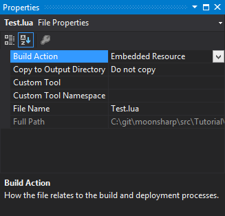

MoonSharp is meant to support multiple platforms. It can't choose which platforms it will run on, as that's the choice of the end user of the library, so it has somehow to be able to run, say, as a daemon in Linux, as a WPF application, as an app on a mobile phone or a game on a console. For example, APIs as simple as a humble FileStream are not available on Windows Store Apps.

Also, MoonSharp doesn't know how it's supposed to run and work on the app using it. For example, what if you want ``loadfile`` to load from embedded resources instead ?

For these reasons MoonSharp has two objects hierarchies:

* Script loaders - used to customize how APIs loading scripts from files work
* Platform accessors - used to customize how low level access to OS is done

> Note that usually script loaders are independent from platform accessors, although they can use their method if they want. This just to say that if,
> for example, your platform accessor does not support loading from file, it doesn't necessarily mean that your script loader can't and viceversa.
>
> They are two separate objects because they handle two different responsibilities. A script loader is responsible for how scripts are loaded from files.
> A platform accessor is responsible for how library functions which should call OS APIs (mostly in the 'os' and 'io' modules) are handled.

#### A quick tour of predefined script loaders

Depending on the platforms you have these choices of script loaders :

* ``FileSystemScriptLoader`` : raw access to files on filesystem, customizable, not supported on portable class libraries
* ``ReplInterpreterScriptLoader`` : same as ``FileSystemScriptLoader``, plus uses the same logic as Lua to get the paths from environment variables (``MOONSHARP_PATH``, ``LUA_PATH`` or ``"?;?.lua"``, whatever exists first)
* ``EmbeddedResourcesScriptLoader`` : offers access to embedded resources of a given assembly instead of the file system
* ``InvalidScriptLoader`` : throws exceptions
* ``UnityAssetsScriptLoader`` : works on Unity3D, to load scripts from text assets 

The default script loader used by MoonSharp if no redefinition happens is selected as follows:

* If running under Unity3D, the default script loader is ``UnityAssetsScriptLoader`` over the ``Assets/Resources/MoonSharp/Scripts`` path. Files must have .txt extension (Unity is weird).
* If the current build is as a portable class library, ``InvalidScriptLoader`` is selected (and you can't load from files unless you do something)
* Otherwise, ``FileSystemScriptLoader`` is used

#### How to specify which script loader to use

Let's say we want to have script loaded from embedded resources of the current assembly.

There are basically two ways, one local one global. 

First, given a script you can change its script loader with:


script.Options.ScriptLoader = new EmbeddedResourcesScriptLoader();


Otherwise, the following can be used to specify that all newly created scripts should use the new script loader:


Script.DefaultOptions.ScriptLoader = new EmbeddedResourcesScriptLoader();


#### How to customize the behavior of the require function 

A common need is to change which directories are used by the ``require`` function to load modules.

Most script loaders extend the ``ScriptLoaderBase`` class which exposes a ``ModulePaths`` property which contains all the paths that will be checked to load modules.

You can easily change the paths:


// These two lines are equivalent:
((ScriptLoaderBase)script.Options.ScriptLoader).ModulePaths = new string[] { "MyPath/?", "MyPath/?.lua" };
// or
((ScriptLoaderBase)script.Options.ScriptLoader).ModulePaths = ScriptLoaderBase.UnpackStringPaths("MyPath/?;MyPath/?.lua");


Note that the ``ScriptLoaderBase`` also checks the ``LUA_PATH`` global variable in the current ``_ENV`` to decide which paths to use to load modules. 
If you want the ``LUA_PATH`` global to be ignored, use:


((ScriptLoaderBase)script.Options.ScriptLoader).IgnoreLuaPathGlobal = true;


> A word of caution. Changing the ``ModulePaths`` and/or ``IgnoreLuaPathGlobal`` is **not** enough to "sandbox" which files can be loaded. If you need this, 
implement a custom script loader.

#### How to use EmbeddedResourcesScriptLoader

Embedding scripts as resources is easily done.

In Visual Studio:
* Create a "Scripts" folder in your project
* Add new text file inside that folder and rename it Test.lua
* Type some Lua code in that file

Then, right-click on the file in Solution Explorer, the following window will appear:

Make sure "Build Action" is "Embedded Resource".

After this, let's just use the right script loader:


static void EmbeddedResourceScriptLoader()
{
	Script script = new Script();
	script.Options.ScriptLoader = new EmbeddedResourcesScriptLoader();
	script.DoFile("Scripts/Test.lua");
}


Similar steps can be followed in other IDEs, for example Xamarin.

#### How to create your own script loader

Time to create your own script loader.

You have two options basically : extend ``ScriptLoaderBase`` (reccommended) or implement ``IScriptLoader``.

Both are pretty self-explanatory, but let's go with the first for the sake of it. 

Our script loader, will actually generate a little script on the fly with the name of the requested file instead of really loading:


private class MyCustomScriptLoader : ScriptLoaderBase
{
	public override object LoadFile(string file, Table globalContext)
	{
		return string.Format("print ([[A request to load '{0}' has been made]])", file);
	}

	public override bool ScriptFileExists(string name)
	{
		return true;
	}
}


Getting this to work is pretty easy:


static void CustomScriptLoader()
{
	Script script = new Script();

	script.Options.ScriptLoader = new MyCustomScriptLoader() 
	{ 
		ModulePaths = new string[] { "?_module.lua" } 
	};

	script.DoString(@"
		require 'somemodule'
		f = loadfile 'someothermodule.lua'
		f()
	");
}


Running all of this, as predictable, will print:

	A request to load 'somemodule_module.lua' has been made
	A request to load 'someothermodule.lua' has been made

